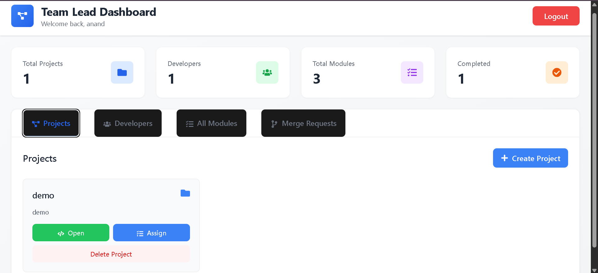
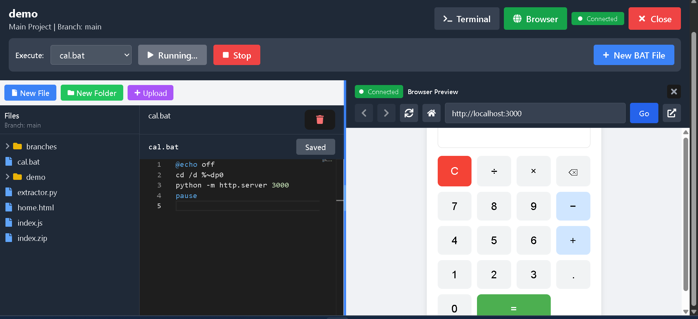
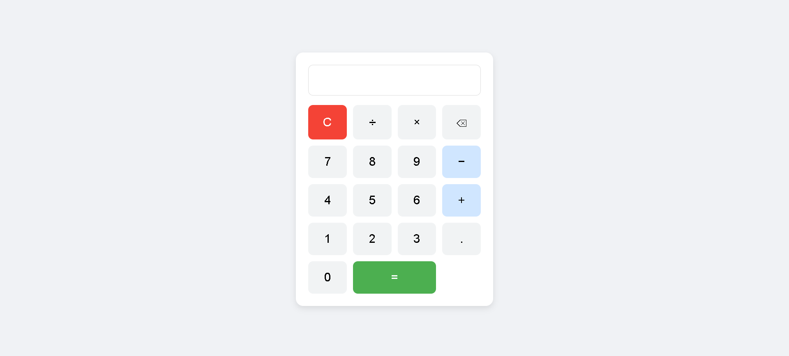
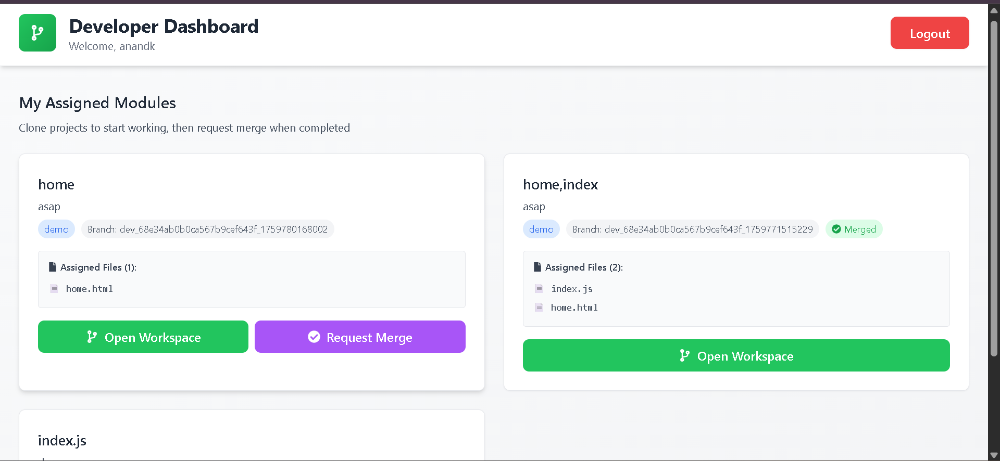

# About Project Collaboration Platform

## Project Vision

The Project Collaboration Platform was designed to solve common challenges in team-based software development, particularly for small to medium-sized teams working on multiple concurrent projects.

## Motivation

Traditional project management tools often lack integrated development environments, while IDEs lack proper project management features. This platform bridges that gap by combining:

- Project management
- Task assignment
- Code editing
- Version control (branch-based workflow)
- Real-time collaboration
- Code execution and preview

## Architecture Overview

### System Design

The platform follows a client-server architecture with three main layers:

1. **Presentation Layer (Frontend)**
   - React-based SPA
   - Real-time UI updates via WebSocket
   - Monaco Editor for code editing
   - Responsive design with Tailwind CSS

2. **Application Layer (Backend)**
   - RESTful API with Express.js
   - JWT-based authentication
   - Role-based access control
   - Real-time event handling with Socket.IO

3. **Data Layer**
   - MongoDB for persistent storage
   - File system for project files
   - Branch isolation using directory structure

### Data Flow
```bash
User Action → Frontend Component → API Call → Backend Controller
↓
Business Logic Processing
↓
Database/File System Operation
↓
WebSocket Broadcast
↓
Real-time Update to All Connected Clients
```


##  User Interface Design

### Design Principles

1. **Simplicity**: Clean, intuitive interface
2. **Responsiveness**: Adapts to different screen sizes
3. **Visual Hierarchy**: Clear distinction between different sections
4. **Feedback**: Immediate visual feedback for user actions

### Color Scheme

- **Primary**: Blue (#3B82F6) - Actions, links
- **Success**: Green (#10B981) - Completed, approved
- **Warning**: Yellow (#F59E0B) - Pending, in-progress
- **Danger**: Red (#EF4444) - Delete, reject
- **Neutral**: Gray scale - Background, text

## Security Features

### Authentication & Authorization

- JWT-based token authentication
- Password hashing with bcrypt (10 salt rounds)
- Role-based access control (Team Lead, Developer)
- Protected routes and endpoints
- Token expiration handling

### Data Protection

- Input validation on both client and server
- SQL injection prevention (MongoDB parameterized queries)
- XSS protection (React's built-in escaping)
- CORS configuration for API security

##  Performance Optimizations

1. **Frontend**
   - Code splitting with React.lazy
   - Debounced file search
   - Virtual scrolling for large file lists
   - Optimized re-renders with React.memo

2. **Backend**
   - Database indexing on frequently queried fields
   - Efficient file system operations
   - Connection pooling for MongoDB
   - Compressed WebSocket messages

3. **File Operations**
   - Recursive directory traversal with optimization
   - Large file handling with streams
   - Cached file tree structure

## Workflow Implementation

### Branch Management

Each module gets an isolated branch with the naming convention:
`{developer-username}_{project-name}_{module-name}`

Benefits:
- No code conflicts between developers
- Easy identification of who's working on what
- Clean merge history
- Parallel development

### Merge Request Flow

```bash
Developer Completes Work → Request Merge → Team Lead Reviews
↓
Approve ←→ Reject (with reason)
↓ ↓
Merge to Main Branch Developer Fixes
```


## Statistics & Monitoring

The dashboard provides real-time statistics:
- Total projects
- Active developers
- Assigned modules
- Completion rate

## Use Cases

1. **Software Development Teams**
   - Full-stack development projects
   - Multiple concurrent projects
   - Feature-based development

2. **Educational Institutions**
   - Student project assignments
   - Code review and grading
   - Collaborative learning

3. **Freelance Teams**
   - Client project management
   - Task distribution
   - Code delivery and review

## Future Enhancements

### Planned Features

- [ ] Git integration for version control
- [ ] Pull request diff viewer
- [ ] Code review comments
- [ ] Time tracking per module
- [ ] Project analytics dashboard
- [ ] Email notifications
- [ ] Multi-language support
- [ ] Dark mode
- [ ] Mobile app
- [ ] AI-powered code suggestions
- [ ] Automated testing integration
- [ ] Deployment automation

### Scalability Improvements

- [ ] Microservices architecture
- [ ] Redis for caching
- [ ] Load balancing
- [ ] CDN for static assets
- [ ] Database sharding
- [ ] Kubernetes deployment

##  Screenshots

[Add your screenshots here in the following format:]

### Dashboard View


### Code Editor


### Browser Preview


### Merge Request


##  Acknowledgments

This project was built using various open-source libraries and frameworks. Special thanks to:

- React Team for the amazing UI library
- Monaco Editor team for the code editor
- Socket.IO for real-time capabilities
- Tailwind CSS for the styling framework
- MongoDB team for the database

##  Project Timeline

- **October 2025**: Initial development
- **Phase 1**: Core authentication and project management
- **Phase 2**: Workspace and file management
- **Phase 3**: Merge request workflow
- **Phase 4**: Terminal and browser integration
- **Phase 5**: Performance optimization and bug fixes

##  Development Team

**Developer**: ANAND KAMAN
**Email**: kamananand98@gmail.com
**GitHub**: [@anandkaman](https://github.com/anandkaman)

## Version History

- **v1.0.0** (October 2025)
  - Initial release
  - Core features implemented
  - Basic authentication and authorization
  - Project and module management
  - Integrated workspace
  - Merge request workflow

